# HOLIDAY PROJECT DOCUMENTATION

## 1. Introduction

The Holiday project is a simple infrastructure as code (IaC) project that uses Terraform to create a basic infrastructure on AWS. The infrastructure includes a VPC, subnets, route tables, internet gateway, NAT gateway, elastic IP, security groups, Route 53, load balancer, autoscaling group, launch configuration, and EC2 instances. The project is designed to demonstrate how to use Terraform and Ansible to create and configure infrastructure on AWS.

## 2. Aim

The aim of this project is to set up two EC2 instances (free tier instances can be used to avoid charges) in a VPC in any region of choice. Nginx should be installed on the EC2 instances, and the default landing page should be a webpage that displays its hostname or IP address. This setup should be achieved using Ansible. The EC2 instances must be in a private subnet and should not be accessible via their respective IP addresses; access should only be through the load balancer. The instances must not be assigned public IP addresses. Auto scaling may or may not be used. A custom domain name should be used to access the webpage.

## 3. Plan

There are three major challenges in this project:

1. Using a private subnet for the EC2 instances: The EC2 instances that will host the Nginx web server are to be placed in a private network and not assigned public IP addresses. This means that the instances will not be directly accessible from the internet, but will be able to access the internet. To achieve this, a NAT gateway will be used to allow the instances to access the internet. The NAT gateway will be placed in a public subnet, and the private subnet will be configured to use the NAT gateway as its route to the internet.

2. Accessing the EC2 instances through the load balancer: The EC2 instances will be placed behind a load balancer, and the load balancer will be placed in a public subnet. The load balancer will be the only point of access to the EC2 instances. The load balancer will be configured to listen on port 80 and forward requests to the EC2 instances on port 80.

3. Using Ansible to provision the private EC2 instances: Ansible will be used to install Nginx on the EC2 instances and to configure the default landing page to display the hostname or IP address of the instance. The Ansible playbook will be run on the EC2 instances after they have been created. However, the challenge here is that Ansible requires SSH to provision the instances, and the instances are in a private subnet and do not have public IP addresses. To solve this, a bastion host will be created in the public subnet, and the Ansible playbook will be run on the bastion host. The bastion host will be able to access the private instances through the load balancer.

## 4. Implementation & Architecture

Two public subnets and two private subnets will be created in a VPC. The public subnets will be used for the NAT gateway and the load balancer, and the private subnets will be used for the EC2 instances. An internet gateway will be created and attached to the VPC. A route table will be created and associated with the public subnets to allow access to the internet. A NAT gateway will be created and placed in one of the public subnets. A route table will be created and associated with the private subnets to allow access to the internet through the NAT gateway. A security group will be created and associated with the EC2 instances to allow access to the instances through the load balancer. A load balancer will be created and placed in one of the public subnets. An autoscaling group and launch configuration will be created to manage the EC2 instances. A Route 53 record set will be created to point to the load balancer.

The bastion host has a bash script that installs Ansible and runs the Ansible playbook to provision the EC2 instances once they have been created.

The Ansible playbook will be run on the bastion host to install Nginx on the EC2 instances and to configure the default landing page to display the hostname or IP address of the instance.

The architecture of the infrastructure is as follows:

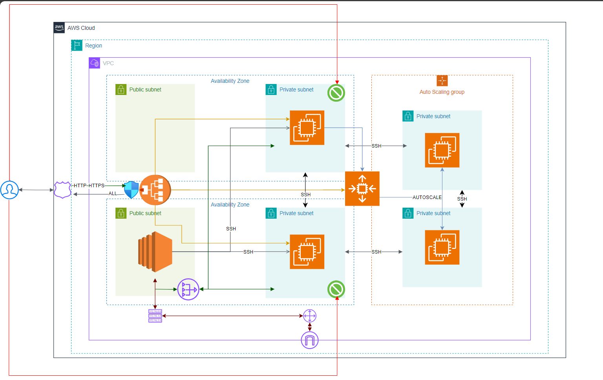

## 5. Prerequisites

The following tools are required to run the project:

- A host machine (any OS can be used)
- An AWS account with the necessary permissions and credentials
- Terraform installed on the host machine
- AWS CLI installed on the host machine
- A text editor (e.g., Visual Studio Code) installed on the host machine

## 6. Usage

To run the project, follow these steps:

1. Clone the repository to the host machine.
2. Change directory to the project directory.
3. Create a `terraform.tfvars` file in the project directory and set the following variables:

    ```hcl
    profile        = ""
    cidr_block     = ""
    project_name   = ""
    instance_type  = ""
    domain_name    = ""
    subdomain_name = ""
    ami_id         = ""
    ```

    Input the appropriate values for the variables. The `profile` variable is the AWS CLI profile to use. The `cidr_block` variable is the CIDR block for the VPC. The `project_name` variable is the name of the project. The `instance_type` variable is the type of EC2 instance to create. The `domain_name` variable is the domain name to use for the Route 53 record set. The `subdomain_name` variable is the subdomain name to use for the Route 53 record set. The `ami_id` variable is the ID of the AMI to use for the autoscaling group launch configuration.

    NOTE: The `ami_id` was obtained from a snapshot taken of one of the healthy running private EC2 instances. The snapshot was then used to create an AMI. The AMI ID was then used in the `terraform.tfvars` file.

4. Run the following commands to create the infrastructure:

    ```bash
    terraform init # to initialize the project
    terraform validate # to ensure there are no errors in the project
    terraform plan -var-file="terraform.tfvars" # to view the changes that will be made to the infrastructure
    terraform apply -var-file="terraform.tfvars" # to create the infrastructure
    ```

    NOTE: To destroy the infrastructure, run the following command:

    ```bash
    bash tf-destroy.sh
    ```

    The `tf-destroy.sh` script is a simple bash script that runs the terraform destroy command and automatically approves the destruction of the infrastructure. After the infrastructure has been destroyed, it creates an empty `.pem` file in the project directory. This is to prevent an error that occurs when the `.pem` file is not present in the project directory. In this case, the `.pem` file is called `holiday.pem`.

5. After the infrastructure has been created, the public DNS of the load balancer can be used to access the webpage. The public DNS can be found in the AWS Management Console under EC2 > Load Balancers > Description > DNS name. The Subdomain name can also be used to access the webpage. The subdomain name can be found in the AWS Management Console under Route 53 > Hosted zones > Name.

## 7. Testing

The infrastructure can be tested by accessing the webpage using the public DNS of the load balancer or the subdomain name. The webpage should display the hostname or IP address of the instance.

The images below show the instances in the AWS Management Console (including the bastion host and the Auto Scaling Group instances):

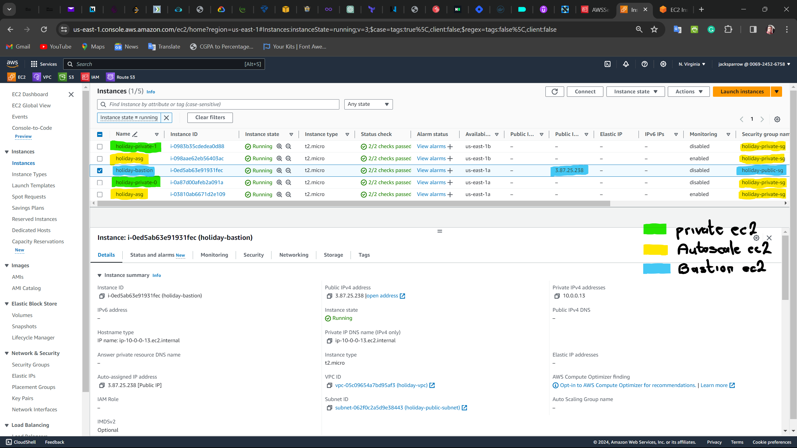

The image below shows the target groups for the load balancer in the AWS Management Console:

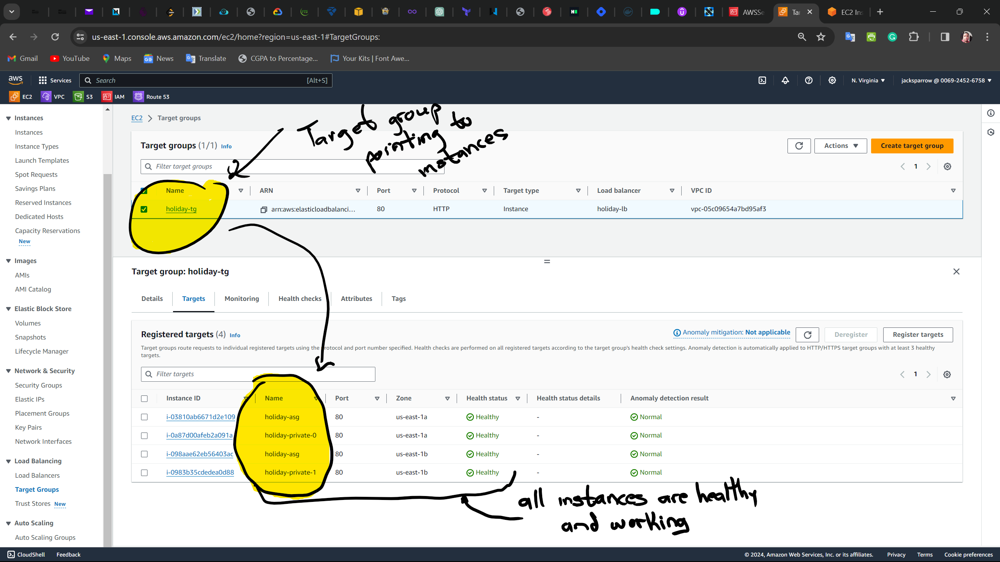

The image below shows the load balancer in the AWS Management Console:

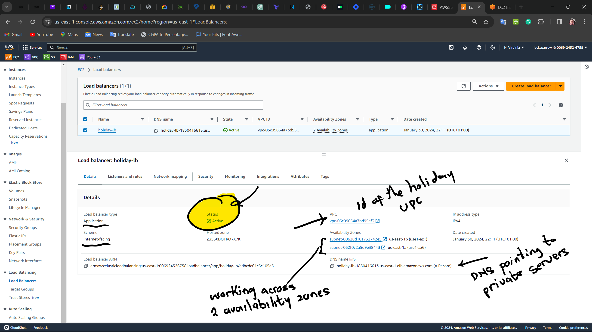

The image below shows the Route 53 record set in the AWS Management Console:

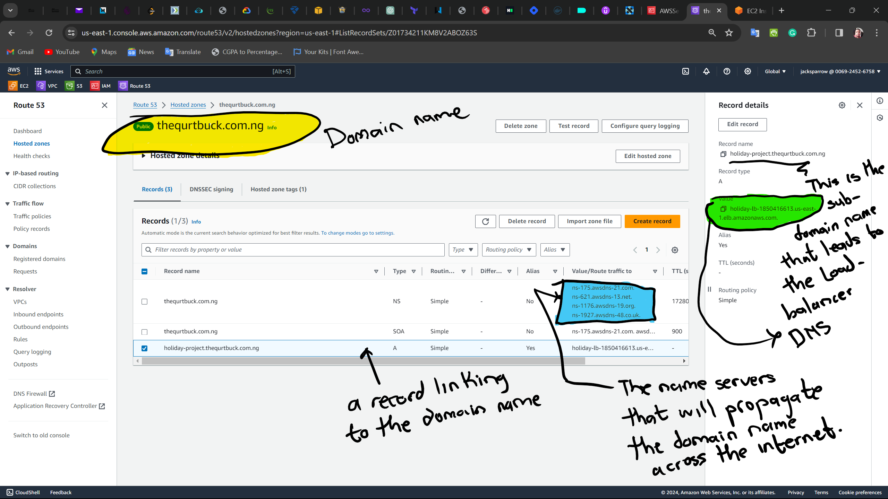

The image below shows the snapshot of the private EC2 in the AWS Management Console:

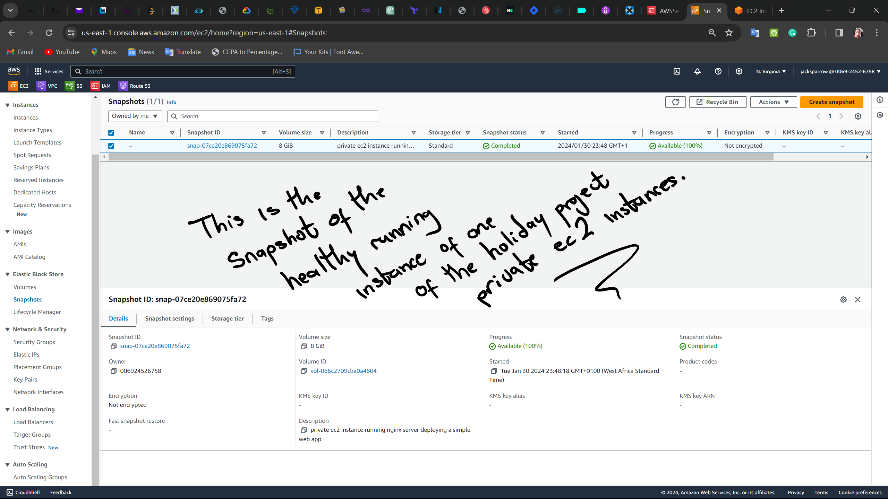

The image below shows the AMI made from the snapshot in the AWS Management Console:

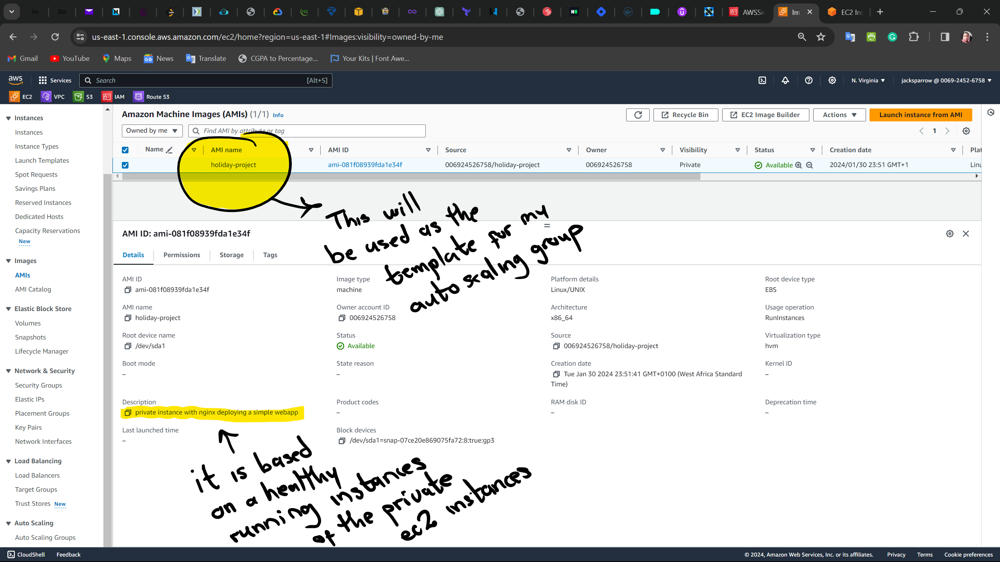

The images below show the Auto scaling group details in the AWS Management Console:

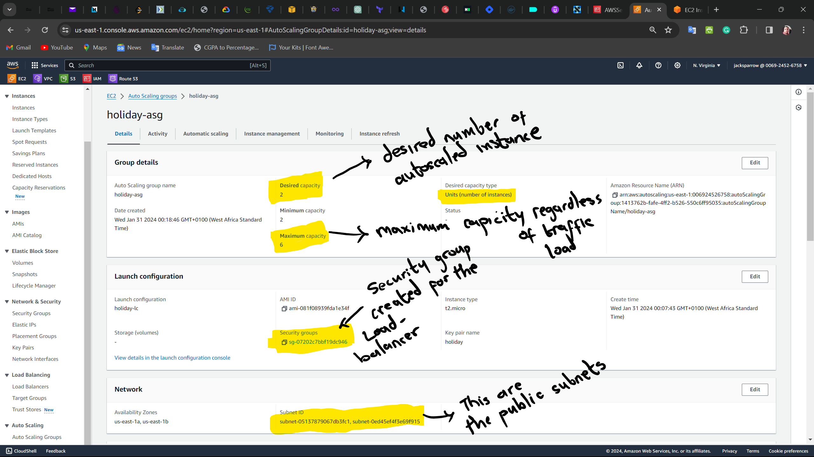

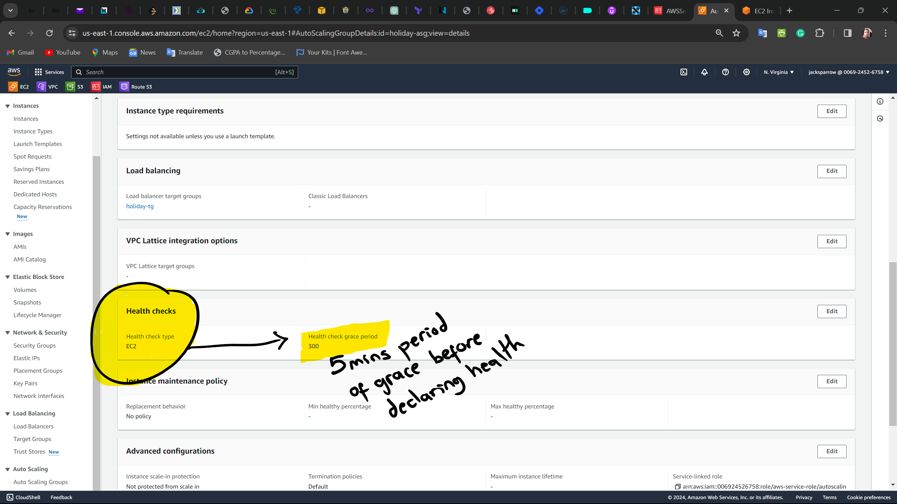

The image below shows the ansible configuration files in the bastion host:

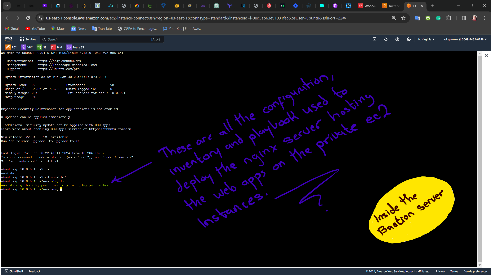

The image below shows a sneak peek into one of the ASG instances on the bastion host:

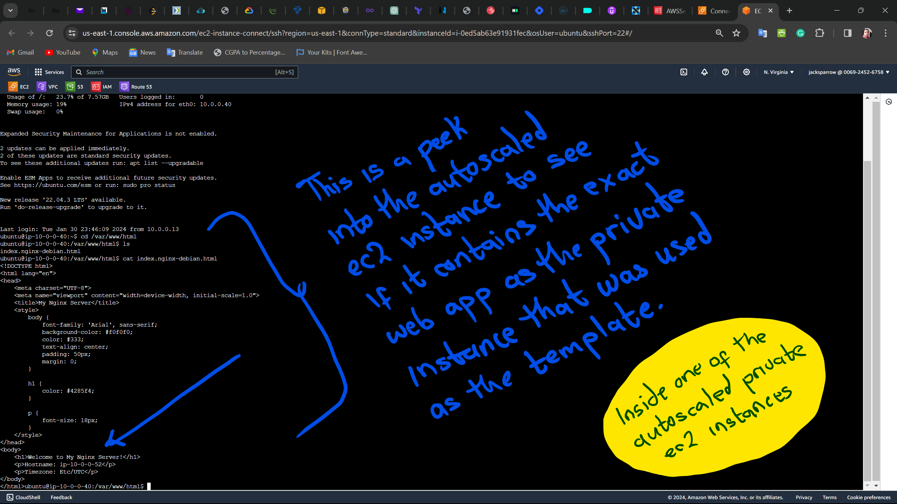

## 8. Contributions

Contributions to the project are welcome. To contribute, fork the repository, make changes, and create a pull request.

## 9. Conclusion

The project demonstrates how to use Terraform and Ansible to create and configure infrastructure on AWS. It creates a VPC, subnets, route tables, internet gateway, NAT gateway, elastic IP, security groups, Route 53, load balancer, autoscaling group, launch configuration, and EC2 instances. The project also uses a bastion host to run an Ansible playbook to provision the EC2 instances. It is a simple demonstration of how to use Terraform and Ansible to create and configure infrastructure on AWS.
